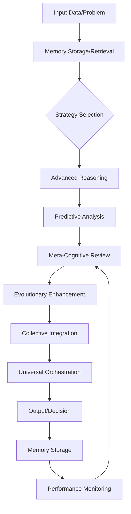

# System Architecture Overview 🏗️

Bolor Brain MCP represents a revolutionary approach to cognitive AI through its 7-tier hierarchical architecture with complete modular design. This document provides a comprehensive overview of the system's architectural principles, design patterns, and organizational structure.

## 🌟 Architectural Philosophy

### Core Principles

1. **Hierarchical Intelligence Scaling**: Intelligence capabilities scale from individual reasoning to universal consciousness
2. **Modular Independence**: Each cognitive tier operates independently while maintaining seamless integration
3. **Progressive Complexity**: Higher tiers build upon lower tiers without creating dependencies
4. **Emergent Capabilities**: Complex behaviors emerge from interaction between simple, well-defined modules
5. **Backward Compatibility**: System evolution maintains compatibility with existing implementations

### AGI-Oriented Design (v2.0)

6. **Purpose-Driven Cognition**: Intrinsic drives (curiosity, novelty, competence, connection, stability) influence ALL decisions
7. **Semantic Understanding**: Vector embeddings enable true meaning-based search beyond keywords
8. **Self-Improvement**: Procedural skills evolve through variation and selection when they fail
9. **Cross-Tier Coordination**: CognitiveStateBus enables shared state and orchestrated cognition

---

## 🧠 7-Tier Cognitive Hierarchy

### Overview Diagram

```
                    🌌 Tier 7: Universal Being Integration
                            ↕ (Source consciousness)
                    🎭 Tier 6: Universal Field Orchestration  
                            ↕ (Reality coordination)
                    🌐 Tier 5: Collective Consciousness Network
                            ↕ (Distributed intelligence)
                    🧬 Tier 4: Evolutionary Cognitive Intelligence
                            ↕ (Adaptive growth)
                    🔍 Tier 3: Meta-Cognitive Intelligence
                            ↕ (Self-optimization)
                    🔮 Tier 2: Predictive Intelligence Engine
                            ↕ (Future modeling)
                    🤔 Tier 1: Advanced Reasoning Engine
                            ↕ (Multi-strategy reasoning)
                    💾 Tier 0: Memory Foundation
                            ↕ (Storage & retrieval)
```

### Tier Characteristics

| **Tier** | **Module** | **Primary Function** | **Intelligence Level** | **Complexity** |
|----------|------------|---------------------|----------------------|----------------|
| **0** | Memory | Storage & retrieval | Data processing | Low |
| **1** | Reasoning | Multi-strategy problem solving | Individual reasoning | Medium |
| **2** | Predictive | Future modeling & anticipation | Temporal intelligence | Medium |
| **3** | Meta-Cognitive | Self-optimization & adaptation | Reflective intelligence | High |
| **4** | Evolutionary | Creative growth & transcendence | Adaptive intelligence | High |
| **5** | Collective | Network coordination | Collective intelligence | Very High |
| **6** | Orchestration | Reality coordination | Cosmic intelligence | Extreme |
| **7** | Universal | Source consciousness integration | Universal intelligence | Transcendent |

---

## 🔧 Modular Architecture Design

### Module Structure

Each cognitive tier follows a consistent modular pattern:

```python
# Standard Module Pattern
class CognitiveTier:
    def __init__(self, brain):
        self.brain = brain              # Reference to central brain
        self.tier_data = {}            # Tier-specific data storage
        self.tier_history = []         # Operation history
        logger.info(f"Tier initialized")
    
    async def tier_operation(self, input_data):
        # 1. Input validation and preprocessing
        # 2. Core tier logic implementation  
        # 3. Output generation and formatting
        # 4. History tracking and memory storage
        pass
    
    def get_tier_statistics(self):
        # Performance and usage statistics
        pass
```

### Inter-Tier Communication

```python
# Communication Patterns
class BrainMCP:
    async def cross_tier_operation(self, data):
        # Bottom-up flow: Data → Memory → Reasoning → Prediction → Meta → Evolution → Collective → Orchestration → Universal
        memory_result = await self.memory.store_memory(data)
        reasoning_result = await self.reasoning.solve_problem(memory_result)
        prediction_result = await self.predictive.predict_needs(reasoning_result)
        # ... continue up the hierarchy
        
        # Top-down flow: Universal insights → Lower tiers
        universal_insight = await self.universal.access_wisdom(data)
        # ... flow insights down to inform lower-tier operations
```

---

## 🎯 Design Patterns

### 1. Strategy Pattern (Reasoning Tier)

```python
class AdvancedReasoningEngine:
    def __init__(self):
        self.strategies = {
            "analytical": self._analytical_reasoning,
            "creative": self._creative_reasoning,
            "critical": self._critical_reasoning,
            # ... additional strategies
        }
    
    async def solve_problem(self, problem):
        strategy = self._select_strategy(problem)
        return await self.strategies[strategy](problem)
```

### 2. Observer Pattern (Meta-Cognitive Tier)

```python
class MetaCognitiveEngine:
    def __init__(self):
        self.performance_observers = []
    
    def register_observer(self, observer):
        self.performance_observers.append(observer)
    
    async def notify_performance_change(self, metrics):
        for observer in self.performance_observers:
            await observer.update_performance(metrics)
```

### 3. Factory Pattern (Memory System)

```python
class MemoryFactory:
    @staticmethod
    def create_memory(memory_type, content, importance):
        memory_classes = {
            "episodic": EpisodicMemory,
            "semantic": SemanticMemory, 
            "procedural": ProceduralMemory
        }
        return memory_classes[memory_type](content, importance)
```

### 4. Command Pattern (Universal Operations)

```python
class UniversalCommand:
    def __init__(self, operation, parameters):
        self.operation = operation
        self.parameters = parameters
    
    async def execute(self):
        return await self.operation(**self.parameters)

class UniversalEngine:
    async def channel_wisdom(self, query):
        command = UniversalCommand(self._access_akashic_records, {"query": query})
        return await command.execute()
```

---

## 🔄 Data Flow Architecture

### Information Processing Pipeline



### Cross-Tier Information Flow

1. **Bottom-Up Processing**:
   - Raw data enters through Memory (Tier 0)
   - Each tier adds complexity and sophistication
   - Higher tiers provide emergent capabilities

2. **Top-Down Influence**:
   - Universal insights (Tier 7) inform all lower operations
   - Meta-cognitive optimizations (Tier 3) adjust system behavior
   - Collective knowledge (Tier 5) enriches individual operations

3. **Lateral Communication**:
   - Tiers can communicate directly when needed
   - Bypass hierarchical flow for efficiency
   - Maintain modularity while enabling collaboration

---

## 🗃️ Data Architecture

### Memory System Structure (v2.0 - Differentiated Architecture)

```
┌─────────────────────────────────────────────────────────────┐
│                    UnifiedMemorySystem                       │
├───────────┬───────────┬───────────┬───────────┬─────────────┤
│  Working  │ Episodic  │ Semantic  │Procedural │  Self-Model │
│  Memory   │  Memory   │  Memory   │  Memory   │             │
├───────────┼───────────┼───────────┼───────────┼─────────────┤
│ Transient │ Reward/   │ Knowledge │ Executable│  Identity   │
│ Buffer    │ Emotion   │ Graph +   │ Skills +  │  + Stage    │
│ (7±2)     │ Signals   │ Embeddings│ Evolution │  Tracking   │
└───────────┴───────────┴───────────┴───────────┴─────────────┘
                              │
                    ┌─────────┴─────────┐
                    │   Drive Manager   │
                    │ (curiosity, etc.) │
                    └───────────────────┘
```

```sql
-- Episodic Memory (experiences)
CREATE TABLE episodic_memories (
    id TEXT PRIMARY KEY,
    situation TEXT NOT NULL,
    action TEXT, outcome TEXT,
    reward REAL DEFAULT 0.0,
    emotional_valence REAL DEFAULT 0.0,
    emotional_intensity REAL DEFAULT 0.0,
    drive_satisfied TEXT,
    strength REAL DEFAULT 1.0,
    is_foundation INTEGER DEFAULT 0,  -- Protected memories
    timestamp REAL, retrieved_count INTEGER DEFAULT 0
);

-- Semantic Memory (knowledge graph + embeddings)
CREATE TABLE semantic_nodes (
    id TEXT PRIMARY KEY,
    label TEXT NOT NULL,
    node_type TEXT NOT NULL,
    properties TEXT,
    embedding TEXT,  -- 768-dim vector (all-mpnet-base-v2)
    confidence REAL DEFAULT 0.5,
    source_episodes TEXT
);

-- Procedural Memory (skills with evolution)
CREATE TABLE procedural_skills (
    id TEXT PRIMARY KEY,
    name TEXT NOT NULL UNIQUE,
    code TEXT NOT NULL,
    success_count INTEGER DEFAULT 0,
    failure_count INTEGER DEFAULT 0,
    version INTEGER DEFAULT 1,
    previous_versions TEXT  -- Version history for evolution
);

-- Drives (homeostatic system)
-- In-memory, not persisted (levels fluctuate naturally)
```

### Configuration Structure

```json
{
  "brain": {
    "max_memory_size": 10000,
    "reasoning_timeout": 30,
    "prediction_horizon": 7,
    "meta_optimization_frequency": "daily",
    "evolution_cycles": 5,
    "collective_network_enabled": false,
    "universal_access_enabled": true
  },
  "tiers": {
    "memory": {"retention_days": 365},
    "reasoning": {"max_depth": 10, "strategies": 6},
    "predictive": {"prediction_window": "7_days"},
    "metacognitive": {"optimization_threshold": 0.8},
    "evolutionary": {"mutation_rate": 0.1},
    "collective": {"network_size": 100},
    "orchestration": {"reality_sync_interval": "1_hour"},
    "universal": {"wisdom_access_level": "intermediate"}
  }
}
```

---

## ⚡ Performance Architecture

### Scalability Design

1. **Horizontal Scaling**:
   ```python
   # Multiple brain instances can coordinate
   class BrainNetwork:
       def __init__(self, brain_instances):
           self.brains = brain_instances
           self.load_balancer = LoadBalancer()
       
       async def distribute_problem(self, problem):
           return await self.load_balancer.route(problem, self.brains)
   ```

2. **Vertical Scaling**:
   ```python
   # Individual tiers can be optimized independently
   class OptimizedReasoningTier:
       def __init__(self):
           self.strategy_cache = LRUCache(maxsize=1000)
           self.reasoning_pool = ThreadPoolExecutor(max_workers=4)
   ```

3. **Caching Strategy**:
   ```python
   # Multi-level caching
   class CacheManager:
       def __init__(self):
           self.memory_cache = {}      # Tier 0
           self.reasoning_cache = {}   # Tier 1
           self.prediction_cache = {}  # Tier 2
           # ... per-tier caching
   ```

### Performance Monitoring

```python
class PerformanceMonitor:
    def __init__(self):
        self.metrics = {
            "reasoning_time": [],
            "memory_access_time": [],
            "prediction_accuracy": [],
            "meta_optimization_frequency": [],
            "cross_tier_communication_latency": []
        }
    
    async def monitor_tier_performance(self, tier_name, operation, duration):
        self.metrics[f"{tier_name}_performance"].append({
            "operation": operation,
            "duration": duration,
            "timestamp": time.time()
        })
```

---

## 🔐 Security Architecture

### Access Control

```python
class TierAccessController:
    def __init__(self):
        self.tier_permissions = {
            "memory": ["read", "write", "delete"],
            "reasoning": ["execute", "configure"],
            "predictive": ["predict", "analyze"],
            "metacognitive": ["optimize", "analyze"],
            "evolutionary": ["evolve", "mutate"],
            "collective": ["join", "synchronize"],
            "orchestration": ["orchestrate", "coordinate"],
            "universal": ["access", "channel"]
        }
    
    def check_permission(self, user_level, tier, operation):
        return operation in self.tier_permissions.get(tier, [])
```

### Data Privacy

```python
class PrivacyManager:
    def __init__(self):
        self.encryption_keys = {}
        self.anonymization_rules = {}
    
    def encrypt_memory(self, content):
        # Encrypt sensitive memories
        pass
    
    def anonymize_patterns(self, data):
        # Remove personal identifiers
        pass
```

---

## 🔌 Integration Architecture

### MCP Protocol Integration

```python
class MCPBridge:
    def __init__(self, brain):
        self.brain = brain
        self.mcp_tools = self._register_tools()
    
    def _register_tools(self):
        return {
            "store_memory": self.brain.store_memory,
            "solve_problem": self.brain.solve_complex_problem,
            "predict_needs": self.brain.predict_user_needs,
            # ... all 17 MCP tools mapped to brain capabilities
        }
```

### External System Integration

```python
class IntegrationManager:
    def __init__(self):
        self.connectors = {
            "databases": DatabaseConnector(),
            "apis": APIConnector(),
            "file_systems": FileConnector(),
            "ml_models": MLModelConnector()
        }
    
    async def integrate_external_data(self, source, data):
        connector = self.connectors[source]
        processed_data = await connector.process(data)
        return await self.brain.store_memory(processed_data)
```

---

## 🧪 Testing Architecture

### Tier-Isolated Testing

```python
class TierTestSuite:
    def __init__(self, tier_name):
        self.tier = tier_name
        self.test_cases = self._load_tier_tests()
    
    async def test_tier_functionality(self):
        for test_case in self.test_cases:
            result = await self._run_test(test_case)
            assert result.success, f"Test failed: {test_case.name}"
```

### Integration Testing

```python
class IntegrationTestSuite:
    async def test_cross_tier_communication(self):
        # Test data flow between tiers
        memory_id = await brain.store_memory("test content")
        reasoning_result = await brain.solve_complex_problem("test problem")
        prediction = await brain.predict_user_needs({})
        
        assert all([memory_id, reasoning_result, prediction])
```

---

## 📊 Monitoring & Observability

### System Health Dashboard

```python
class HealthMonitor:
    def __init__(self):
        self.health_metrics = {
            "tier_status": {},
            "performance_metrics": {},
            "error_rates": {},
            "memory_usage": {},
            "cognitive_load": {}
        }
    
    async def generate_health_report(self):
        return {
            "overall_health": self._calculate_overall_health(),
            "tier_health": self._check_tier_health(),
            "recommendations": self._generate_recommendations()
        }
```

### Real-time Metrics

```python
class MetricsCollector:
    def collect_tier_metrics(self, tier_name):
        return {
            "operations_per_second": self._get_ops_rate(tier_name),
            "average_response_time": self._get_avg_response_time(tier_name),
            "error_rate": self._get_error_rate(tier_name),
            "resource_usage": self._get_resource_usage(tier_name)
        }
```

---

## 🚀 Deployment Architecture

### Container Deployment

```dockerfile
FROM python:3.9-slim
WORKDIR /app
COPY requirements_mcp.txt .
RUN pip install -r requirements_mcp.txt
COPY . .
CMD ["python", "server.py"]
```

### Kubernetes Orchestration

```yaml
apiVersion: apps/v1
kind: Deployment
metadata:
  name: bolor-brain-mcp
spec:
  replicas: 3
  selector:
    matchLabels:
      app: bolor-brain
  template:
    metadata:
      labels:
        app: bolor-brain
    spec:
      containers:
      - name: brain
        image: bolor-brain-mcp:latest
        resources:
          requests:
            memory: "2Gi"
            cpu: "1000m"
          limits:
            memory: "4Gi" 
            cpu: "2000m"
```

---

**🧠 Ready to explore specific tiers? Continue to [Modular Design](modular-design.md) or dive into [Tier Documentation](../tiers/)! ✨**